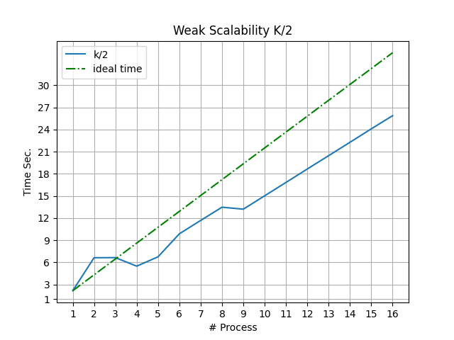
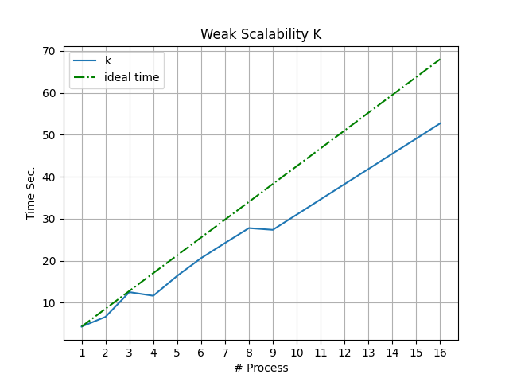
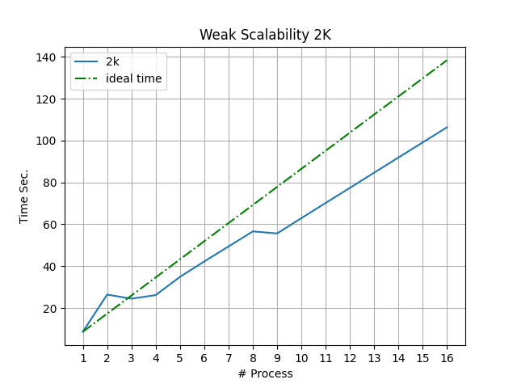
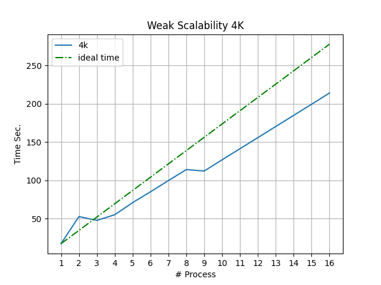
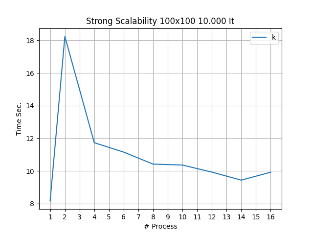
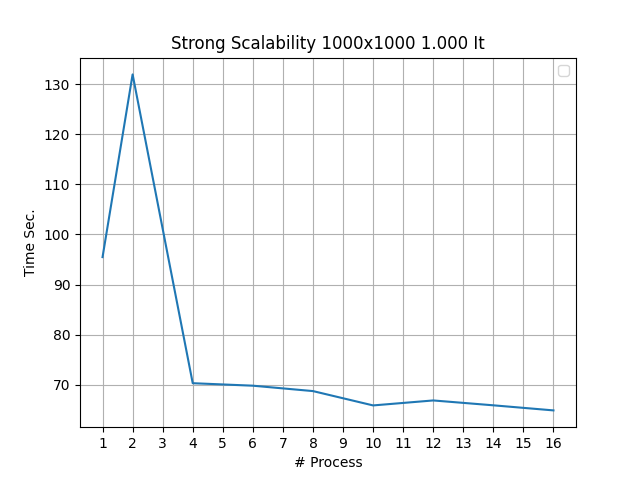
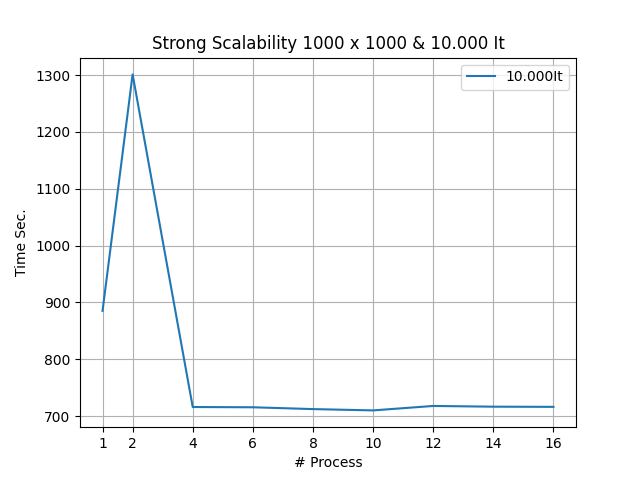

# Game Of Life Report File


**Candidato** : *Rianna Alfonso*

**Matricola** : *0522500862*

**Anno Accademico** : *2019/2020*


# Sommario.
1. Presentazione della soluzione proposta
2. Esposizione della struttura del progetto
	2.1  Descrizione del codice
			2.1.1 main.c
			2.1.2 myUtilsUp.h
	2.2 Compilazione ed esecuzione
3. Analisi delle prestazioni del'algoritmo
	3.1 Scalabilità Debole
	3.2 Scalabilità Forte
4. Descrizione dei risultati
5. Conclusioni

# 1 Presentazione della soluzione proposta
Partendo dal problema "*Game Of Life*" di John Conway, cioè uno degli esempi di automi cellulari più famosi, ho sviluppato un algoritmo parallelo basato sul protocollo di comunicazione Message Passing Interface utilizzando la implementazione Open MPI.
Nella mia soluzione, essendo questo un automa cellulare "*senza giocatori*", cioè l'algoritmo ha bisogno solo dell'input iniziale, ho deciso di rappresentare la prima generazione con una matrice di componenti binarie (gli elementi con valore 0 rappresentno le cellule morte, mentre gli elementi con valore 1 le cellule vive). La matrice di input viene generata in modo pseudocasuale dal processo "*master*", quest ultimo calcola la porzione di matrice da inviare ad ogni processo "*slave*", il master effettua il partitioning, in particolare una domain decomposition della matrice iniziale per righe . Una volta inviata la porzione di matrice ad ogni "*slave*", questi in modo asincrono inviano le zone "*ghost*" della propria porzione e ricevono le altre dai vicini, nel frattempo ognuno calcola le cellule di propria competenza che non necessitano di informazioni altrui, terminato il calcolo si verifica che siano arrivati i dati dai vicini. A questo punto si possono verificare 2 casi:

	1. Sono state ricevuti i dati riguardanti la zona superiore della matrice: allora il processo calcola la parte superiore della matrice
	2. Sono state ricevuti i dati relativi alla parte inferiore della matrice: allora il processo calcola la parte inferiore della matrice.

Terminate entrambe le operazioni, il master raccoglie i risultati da tutti i processi.

# 2 Esposizione della struttura del progetto
Il progetto è strutturato sostanzialmente in 2 file.
1. main.c
2. MyUtilsUp.h

Il primo file contiene inizializzazione MPI ed il main principale, il quale per l'esecuzione dell'algoritmo prevede l'esecuzione di funzioni che si trovano nel file 2. `
## 2.1 Descrizione del codice
### 2.1.1 main.c

```c {.numberLines}
#include <stdio.h>
#include <stdlib.h>
#include <mpi.h>
#include "MyUtilsUp.h"

int main(int argc, char* argv[]) {
//Blocco 1
  int myRank, tasks;
  int n = atoi(argv[1]);
  int m = atoi(argv[2]);
  int iterazioni = atoi(argv[3]);
//end
//Blocco 2    
    MPI_Init(&argc, &argv);
    MPI_Comm_rank(MPI_COMM_WORLD, &myRank);
    MPI_Comm_size(MPI_COMM_WORLD, &tasks);
// end  
//Blocco3
    MPI_Datatype rowType;
    MPI_Type_vector(1,m,m,MPI_INT,&rowType);
    MPI_Type_commit(&rowType);
 //end
 //Blocco 4
    MPI_Status status;
    int (*matrix)[m];
    int (*a)[m];
    int dspl[tasks];
    dspl[0]=0;
    int app, row=0;
    int dimArray[tasks];
    int (*nextGen)[m];
// end
//Blocco5
    MPI_Barrier(MPI_COMM_WORLD);
    float startTime= MPI_Wtime();
//end
//Blocco 6
    if(myRank==0){
        matrix = malloc(sizeof(int [n][m]));
        initializeMatrix(n,m,matrix);
        printMatrix(n,m,matrix);

        int resto = n%(tasks-1);
        dimArray[0]=0;
        int start=0,end=0;
        for(int i= 1; i<tasks;++i){
            dimArray[i]= n/(tasks-1);
            if(resto>0){
                dimArray[i]++;
                --resto;
            }
            start=end;
            dspl[i]=start;
            end+=dimArray[i];
        }

    }
//end

//Blocco 7
    MPI_Scatter(&dimArray,1,MPI_INT,&row,1,MPI_INT,0,MPI_COMM_WORLD);
    if(myRank>0){

        app = row +2;
        a = malloc(sizeof(int [app][m]));
        nextGen = malloc(sizeof(int[row][m]));
    }
//end

//Blocco 8
    for(int k=0; k<iterazioni ;++k) {

        runGame(n,m,myRank,tasks,dimArray,rowType,row,dspl,app,a,nextGen,matrix,status);


    }
//end
//Blocco 9
    MPI_Type_free(&rowType);
    MPI_Barrier(MPI_COMM_WORLD);
    float endTime= MPI_Wtime();


    if(myRank==0){
        printMatrix(n,m,matrix);
        printf("Tempo di esecuzione  %f \n", (endTime-startTime));
    }
    MPI_Finalize();
//end
    return 0;
}

```

**Blocco 1**:  Dichiarazione delle variabili che rispettivamente ospiteranno il rank del processo corrente ed il numero di processi totali che concorrono nell'esecuzione dell'algoritmo. Lettura dei valori, passati da riga di comando, "n-m-iterazioni" che rappresentano rispettivamente numero di righe, colonne e iterazioni da effettuare.

**Blocco 2**:  Inizializzazione MPI, assegnazione della variabile myRank con l'identificativo del processo e tasks con il numero di processi totali che concorrono alla esecuzione dell'algoritmo.

**Blocco 3**: Dichiarazione del tipo di dato vector "rowType" che rappresenta una riga della matrice con relativo commit.

**Blocco 4**: Dichiarazione  delle matrici matrix (matrice iniziale), a(sottomatrice di appoggio per ogni processo) e nextGen(sottomatrice della successiva generazione di cellule). Dichiarazione ed inizializzazione dei vettori dspl e dimArray che rappresentano i displacements e il numero di righe della sottomatrice per ogni processo.

**Blocco 5**: All'interno della variabile startTime viene catturato l'istante di inizio dell'algoritmo, questo dopo una barriera per essere sicuri che tutti i processi siano sincronizzati sullo stesso punto.

**Blocco 6**: Il processo Master con Rank == 0 alloca in memoria lo spazio necessario a contenere la matrice di partenza, la inizializza con valori pseudocasuali e la mostra su standard output. A questo punto calcola in base ai processi che sono disponibili il numero di righe da assegnare ad ogni processo aggiornando gli elementi in posizione i-esima i vettori dspl e dimArray. Se il numero di righe non è divisibile (senza resto) per il numero di processi (escluso il master) allora ai primi "resto" processori viene assegnata una riga in più.

**Blocco 7**: Tramite funzione di comunicazione collettiva "Scatter", il processo Master invia ad ogni processo Slave il numero di righe da elaborare. Ogni processo Slave inizializza la variabile "app" con il numero di righe da elaborare +2 ,alloca spazio in memoria per la sottomatrice da elaborare (con 2 righe aggiuntive, che serviranno ad ospitare la prima e ultima riga di competenza dei processi myRank-1 e myRank+1 ) e per la matrice nextGen che rappresenta la generazione successiva.

**Blocco 8**: viene eseguito il calcolo della generazione successiva per il numero di volte specificato dalla variabile "iterazioni".

**Blocco 9**: Viene rilasciato il tipo di dato "rowType", viene catturato il tempo di terminazione dell'algoritmo ed il processo master mostra su standard output la matrice finale insieme al tempo di esecuzione. Infine ogni processo chiama la funzione MPI_Finalize().  

### 2.1.2 MyUtilsUp.h
``` c
void printMatrix(int n,int m,int(*matrix)[m]){  
    for(int i=0; i<n;++i){  
        for (int j=0; j<m;++j){  
            printf(" %d ",matrix[i][j]);  
  }  
        printf("\n");  
  }  
    printf("\n");  

}  


void initializeMatrix(int n, int m, int (*matrix)[m]){  
    srand(12);  
 for(int i=0; i<n;++i){  
        for(int j=0; j<m;++j){  
            matrix[i][j]= rand()%2;  
  }  
    }  
}  
/*Funzione di modulo che non esiste in C99*/  
int mod(int a, int b)  
{  
    int r = a % b;  
 return r < 0 ? r + b : r;  
}  

int verifyCellula(int i,int j,int n,int m,int elem[n][m], int count,int rank){  
    /*  
 Any live cell with fewer than 2 live neighbors dies as if caused by underpopulation. Any live cell with 2 or 3 live neighbors lives on to the next generation. Any live cell with more than 3 live neighbors dies, as if by overpopulation. Any dead cell with exactly 3 live neighbors becomes a live cell, as if by reproduction.*/  

  count += elem[mod(i-1,n)][j % m];  
  count+= elem[(i+1)%n][j%m];  
  count+= elem[i%n][mod(j-1,m)];  
  count+= elem[i%n][(j+1)%m];  
  count+= elem[mod(i-1,n)][mod(j-1,m)];  
  count+= elem[(i+1)%n][(j+1)%m];  
  count+= elem[mod(i-1,n)][(j+1)%m];  
  count+= elem[(i+1)%n][mod(j-1,m)];  


 if(elem[i][j]==1 && count < 2)  
     return 0; //Cellula morta per sottopopolazione  

  if(elem[i][j]==1 && (count>=2 && count <=3))  
        return 1; //Cellula sopravvive alla prossima Generazione  
  if(elem[i][j]==1 && count>3)  
        return 0; //Cellula morta per sovrapopolazione  
  if(elem[i][j]==0 && count==3)  
        return 1; //Cellula Rinasce per la prossima generazione  

}  

void runGame(int n,int m,int myRank, int tasks, int dimArray[tasks], MPI_Datatype rowType, int row, int dspl[tasks], int app, int (*a)[m],int (*nextGen)[m],int (*matrix)[m],MPI_Status status ){  
    MPI_Scatterv(matrix, dimArray, dspl, rowType, &a[1][0], row, rowType, 0, MPI_COMM_WORLD);  
 if (myRank > 0) {  

        int count = 0;  

  //Invio al mio precedente la prima riga della mia zona  
  MPI_Request request;  
 int dest = myRank == 1 ? (tasks - 1) : myRank - 1;  
  //TAG = 2  invio riga 1 al mio precedente  
  MPI_Isend(&a[1][0], 1, rowType, dest, 2, MPI_COMM_WORLD, &request);  
  dest = (myRank == tasks - 1) ? 1 : myRank + 1;  
  //TAG = 3 invio la ultima riga al mio successivo  
  MPI_Isend(&a[row][0], 1, rowType, dest, 3, MPI_COMM_WORLD, &request);  

  MPI_Request requests[2];  
 int source = myRank == 1 ? (tasks - 1) : myRank - 1;  
  MPI_Irecv(&a[0][0], m, MPI_INT, source, 3, MPI_COMM_WORLD, &requests[0]);  
  source = myRank == (tasks - 1) ? 1 : myRank + 1;  
  MPI_Irecv(&a[app - 1][0], m, MPI_INT, source, 2, MPI_COMM_WORLD, &requests[1]);  

 for (int i = 2; i < (app - 2); ++i) {  
            for (int j = 0; j < m; ++j) {  

                nextGen[i - 1][j] = verifyCellula(i, j, app, m, a, count, myRank);  

  count = 0;  
  }  
        }  
        int countRecv = 2;  
 int idx;  
 while (countRecv > 0) {  
            MPI_Waitany(2, requests, &idx, &status);  
 if (idx == 0)  
                for (int j = 0; j < m; ++j) {  

                    nextGen[0][j] = verifyCellula(1, j, app, m, a, count, myRank);  

  count = 0;  
  }  
            else {  
                for (int j = 0; j < m; ++j) {  

                    nextGen[row - 1][j] = verifyCellula(row, j, app, m, a, count, myRank);  

  count = 0;  
  }  
            }  
            --countRecv;  
  }  
    }  

    MPI_Gatherv(&nextGen[0][0], row, rowType, matrix, dimArray, dspl, rowType, 0, MPI_COMM_WORLD);  
}
```
**printMatrix**: funzione che preso in input numero di righe, colonne e la matrice,  mostra su standard output la matrice passata in input.

**initializeMatrix**: inizializza la matrice passata in input con valori pseudocasuali. Per ogni elemento della matrice tramite la funzione "rand()" genera un valore casuale, e tramite l'operazione remainder 2, restituisce un intero nell'intervallo [0,1]. Il seed per la generazione dei numeri pseudocasuali è impostato a 12, questo permette poi di effettuare confronti con la matrice generata nella versione sequenziale.

**mod**: questa funzione implementa la operazione di modulo, siccome l'operatore "%" in C rappresenta il remainder, nel momento in cui si trova a lavorare con numeri negativi (questo accade siccome la griglia di gioco è toroidale) restituisce un valore negativo, questo non è accettabile e causa problemi di indirizzi non mappati in memoria. Tramite questa funzione calcolo il resto, se questo è negativo sommo il divisore altrimenti restituisco il resto calcolato.

**verifyCellula**: funzione che si occupa di calcolre lo stato di una cellula nella generazione successiva, ovvero applica le regole dell'automa cellulare. Tramite un contatore quantifica il numero di cellule vicine "vive" (il cui valore è 1), fatto questo tramite lo stato della cella attuale e tramite il numero dei suoi vicini vivi restituisce lo stato della stessa nella generazione seguente.

**runGame**: funzione core dell'algoritmo, tramite la funzione di comunicazione collettiva "Scatterv", il processo Master suddivide la matrice iniziale in sottomatrici inviando al processo i-esimo dimArray [ i ] righe partendo dalla posizione dspl[i], ogni processo colleziona la matrice nella sottomatrice a (partendo da [ 1 ] [ 0 ] siccome prima e ultima riga come indicato nella descrizione del main occorrono per le righe adiacenti nella matrice di partenza).
A questo punto ogni processo Slave, ricevuta la propria porzione di matrice invia in modo asincrono la prima riga al proceso precedente e ultima riga al processo successivo, la destinazione è però calcolata in modo condizionale poichè essendo richiesto dal problema una griglia toroidale il primo processo invia e riceve dati dall'ultimo e viceversa. Fatto questo ogni processo inizia ad elaborare le celle che non necessitano di alcuna informazione da altri processi. Terminata tale computazione i processi tramite una Waitany, sono in attesa di ricevere "qualcosa" poichè potrebbero ricevere sia la parte superiore che inferiore della matrice, quindi  sfrutta l'id della richiesta completata in modo tale che se viene ricevuta la zona superiore della matrice si inizia la computazione della prima riga, mentre se viene ricevuta la zona inferiore si inizia la computazione dell'ultima riga. Questo è per ridurre gli stati "*idle*" dei processori.
Terminate tutte le computazioni tramite la funzione di comunicazione collettiva "Ghaterv" il processo Master raccoglie nella matrice iniziale la nuova generazione di cellule.

### 2.2  Compilazione ed esecuzione
Per ompilare ed eseguire l'algoritmo bisogna seguire i seguenti comandi
```
1. mpicc -o run main.c 
2. mpirun --allow-run-as-root -np n_processori run n_colonne n_righe n_iterazioni

```
# 3 Analisi delle prestazioni dell'algoritmo
## 3.1 Scalabilità Debole
*P*= 16 *K* = 500.000 
### 3.1.1 K/2
|  1 |2   | 3  |4   | 5  |6   | 7  |  8 | 9  |  10 |  11 |  12 |  13 |  14 | 15  |  16 |
|---|---|---|---|---|---|---|---|---|---|---|---|---|---|---|---|
| 250k  | 500k  | 750k  | 1000k  |1250k   | 1500k  | 1750k  | 2000k  |2250k   | 2500k  | 2750k  |3000k   | 3250k  | 3500k  |  3750k | 4000k  |



### 3.1.2 K

|  1 |2   | 3  |4   | 5  |6   | 7  |  8 | 9  |  10 |  11 |  12 |  13 |  14 | 15  |  16 |
|---|---|---|---|---|---|---|---|---|---|---|---|---|---|---|---|
| 500k  | 1000k  | 1500k  | 2000k  |2500k   | 3000k  | 4500k  | 5000k  |5500k   | 6000k  | 6500k  |7000k   | 7500k  | 8000k  |  8500k | 9000k  |



### 3.1.3 2K

|  1 |2   | 3  |4   | 5  |6   | 7  |  8 | 9  |  10 |  11 |  12 |  13 |  14 | 15  |  16 |
|---|---|---|---|---|---|---|---|---|---|---|---|---|---|---|---|
| 1000k  | 2000k  | 3000k  | 4000k  |5000k   | 6000k  | 7000k  | 8000k  |9000k   | 10000k  | 11000k  |12000k   | 13000k  | 14000k  |  15000k | 16000k  |



### 3.1.4 4K
|  1 |2   | 3  |4   | 5  |6   | 7  |  8 | 9  |  10 |  11 |  12 |  13 |  14 | 15  |  16 |
|---|---|---|---|---|---|---|---|---|---|---|---|---|---|---|---|
| 2000k  | 4000k  | 6000k  | 8000k  |10000k   | 12000k  | 14000k  | 16000k  |18000k   | 20000k  | 22000k  |24000k   | 26000k  | 28000k  |  30000k | 32000k  |



## 3.2  Scalabilità Forte
N_Righe = 100 -  N_Colonne = 100 - Elementi= 10.000 - Iterazioni = 10.000


| P | 2 | 4 | 6 | 8 | 10 | 12 | 14 | 16 |
|---------|---|---|---|---|----|----|----|----|
| Speedup | 0,447 | 0,696 | 0,732 | 0,783 | 0,788 | 0,822 | 0,865 | 0,823 |

N_Righe = 1000 -  N_Colonne = 1000 - Elementi= 1.000.000 - Iterazioni = 1.000



| P | 2 | 4 | 6 | 8 | 10 | 12 | 14 | 16 |
|---------|---|---|---|---|----|----|----|----|
| Speedup | 0,724 | 1,358 | 1,368 | 1,389 | 1,450 | 1,428 | 1,449 | 1,472 |

N_Righe = 1000 -  N_Colonne = 1000 - Elementi= 1.000.000 - Iterazioni = 10.000



| P | 2 | 4 | 6 | 8 | 10 | 12 | 14 | 16 |
|---------|---|---|---|---|----|----|----|----|
| Speedup | 0,680 | 1,236 | 1,237 | 1,243 | 1,247 | 1,233 | 1,235 | 1,236 |

# 4 Descrizione dei risultati
Nella parte superiore del Report file è stato illustrato il tempo di esecuzione dell'algoritmo con un numero di processori che varia da 1 a 16.
Per scalabilità forte intendiamo quanto velocemente deve aumentare la dimensuione del problema per mantenere una efficienza fissa all'aumentare del numero di processi. In pratica la dimensione totale del problema rimane la stessa all'aumentare del numero di processi.
Per scalabilità debole intendiamo la velocità con cui diminuisce l'efficienza quando aumenta il numero di processi, ma la dimensione del problema è fissa, quindi in altre parole la taglia del problema varia insieme al numero di processori facendo si che ogni processore anche modificando la size totale del problema mantenga sempre lo stesso carico computazionale (gestisce lo stesso numero di elementi).
Dai risultati si nota che all'aumentare del numero di processi, la velocità di esecuzione dell'algoritmo e quindi il tempo di esecuzione stesso diminuisce fino ad un certo punto. In tale punto la velocità resta stabile anche all'aumentare del numero di processori, ciò è dovuto sia dalla complessità dell'algoritmo che dall'overhead di comunicazione e dall'ambiente non *HPC* su cui gli esperimenti sono stati effettuati.
Complessivamente osserviamo che per taglie piccole di input (come nell'esempio con 100 x 100 elementi) non conviene andare a paralelizzare il problema, siccome l'overhead di comunicazione ed il lavoro di ogni processore porta ad un tempo di esecuzione equiparabile se non peggiore della versione sequenziale dell'algoritmo. Mentre per una size maggiore del problema (come nell'esempio con una matrice 1000 x 1000 quindi 1.000.000 di elementi) all'aumentare del numero di processori e quindi della disponibilità hardware il tempo di esecuzione migliora.

La soluzione proposta si dimostra quindi positiva verso l'esecuzione parallela. Chiaramente un parametro fondamentale è la taglia dell'input in quanto come dimostrato dagli esperimenti sopra riportati per input banali la soluzione sequenziale si comporta meglio della parallela.

# 4 Conclusioni
In conclusione dopo aver illustrato i risultati precedenti, possiamo osservare come un problema- in questo caso specifico *Game of Life*- può essere risolto in maniera parallela utilizzando più processori. Utilizzare più processori però ovviamente deve essere una necessità dettata sia dal problema sia dalla taglia dello stesso. Con i vari test effettuati possiamo vedere che con lo stesso problema ma taglie diverse possiamo ottenere buoni risultati (taglia elevata) oppure possiamo andare a degradare i tempi di esecuzione(taglia ridotta), perchè comunicazione vuol dire utilizzare cicli macchina per comunicare piuttosto che elaborare, sincronizzare ed andare in competizione per risorse limitate. 


